\newpage


```r
knitr::opts_chunk$set(echo = TRUE)
# Package que contém geradores para a Distribuição Triangular:
library(extraDistr) 
# ver https://search.r-project.org/CRAN/refmans/extraDistr/html/Triangular.html
library(simmer)
library(simmer.plot)


set.seed(42)
```

Condições:

 * Os voos são de 170 passageiros, contudo a ocupação dos voos pode não ser completa; 

 * O Check-in abre 2h antes da partida do voo e fecha 40 min antes da hora da partida;

 * Chegada de passageiros – os passageiros chegam ao check-in de acordo com uma distribuição de Poisson com média diferente consoante o tipo de passageiro: 
      + Economy (média - 1,7); 
      + Business (média - 0,85);

 * Os passageiros Business, assim como os passageiros que sejam membros Gold/Premium são 20% do total dos passageiros. São considerados no sistema como passageiros Vip e são servidos por apenas um balcão de passageiros – o balcão Vip;

 * Os passageiros Vip fazem o check-in entre os 80 e 40 minutos antes do voo; 

 * Os passageiros podem fazer o check-in individualmente ou em grupo; 
no entanto, por uma questão de simplicidade, vamos considerar que os grupos de passageiros fazem o check-in individualmente, pelo que são considerados como passageiros individuais; 

 * A empresa de viação disponibiliza dois balcões para passageiros Economy e um para passageiros Vip. 
Existe ainda uma máquina que pode ser utilizada por passageiros Economy que não tenham que despachar bagagem; 

 * A fila do check-in para os passageiros Economy que tenham bagagem para despachar pode ser única ou por balcão;

 * 75% dos passageiros Economy despacham a bagagem. 
Neste caso, o tempo de atendimento no check-in demora mais 30 segundos;

 * O tempo de atendimento no check-in (tempo de serviço) tem distribuição triangular com parâmetros apresentados na tabela seguinte (em segundos): 

+---------+-----+------+-----+
|         | Min | Moda | Max |
+---------+-----+------+-----+
| Balcão  | 60  | 103  | 120 |
+---------------+------+-----+
| Máquina | 40  | 60   | 90  |
+---------+-----+------+-----+


 * Os voos podem ser servidos por mais de um balcão; 
Do mesmo modo, os balcões podem servir um único voo ou vários voos. 
Contudo, iremos considerar que apenas estamos a servir um voo. 

 ___________________________________________________________________________________


Analise o tempo total do processo de check-in nos dois cenários seguintes: 

# Análise do impacto da estratégia de fila dos balcões não VIP na distribuição do tempo total do check-in

só 1 min

> Decidimos converter todos os tempos em segundos, já que achamos que seria melhor ter essa resolução, para cumprir todas as premissas do problema.


```r
runs <- 100
# Notas:
# se checkin esta aberto entre os 120min (2h00) e os 40min antes do voo, significa estar aberto durante 80min (4800s)
# se checkin para vip esta aberto entre os 80min e os 40min antes do voo, significa estar aberto durante 40min (2400s)

# definicao de tempos (em segundos) e outros parametros necessarios:
overall_checkin_time <- 4800 # tempo total do processo de checkin (80min = 4800s)
close_checkin_all <- overall_checkin_time # t_i em que se da fecho de checkin para todos os passageiros
begin_checkin_economy <- 1 # t_i em que se da abertura do checkin para passageiros economy
begin_checkin_vip <- 2400 # t_i em que se da abertura do checkin para passageiros vip (40min = 2400s)
dur_checkin_vip <- begin_checkin_vip
dur_checkin_economy <- overall_checkin_time

triang_counter_min <- 60 # parametro para distribuicao triangular do atendimento do checkin
triang_counter_mode <- 103 # parametro para distribuicao triangular do atendimento do checkin
triang_counter_max <- 120 # parametro para distribuicao triangular do atendimento do checkin

triang_machine_min <- 40 # parametro para distribuicao triangular do atendimento do checkin
triang_machine_mode <- 60 # parametro para distribuicao triangular do atendimento do checkin
triang_machine_max <- 90 # parametro para distribuicao triangular do atendimento do checkin

vip_passenger_lambda <- 0.85 # parametro lambda para gerador Poisson de passageiros VIP
economy_passenger_lambda <- 1.7 # parametro lambda para gerador Poisson de passageiros Economy

extra_time_luggage <- 30 # tempo de atendimento extra no caso de passageiro economy ter bagagem

n_max <- 170 # maximo de passageiros por voo
prop_economy <- 0.8 # proporcao de passageiros economy
n_max_economy <- n_max * prop_economy # maximo de passageiros da class economy por voo
n_max_vip <- n_max - n_max_economy # maximo de passageiros vip por voo

# Definicao da trajectoria dos passageiros VIP
vip_passenger <-
    trajectory("VIP passenger's path") %>%
    # log_("Arrived at Check-In Area.") %>%
    seize("vip_counter") %>%
    # log_("Making Check-In...") %>%
    timeout(function() rtriang(
        n = 1,
        a = triang_counter_min,
        b = triang_counter_max,
        c = triang_counter_mode)) %>% # a=min, b=max, c=moda
    release("vip_counter") #%>%
    #log_("Check-in completed! Leaving VIP Counter and going to Security Checkpoint.")

# Definicao da trajectoria dos passageiros Economy

economy_passenger <- 
    trajectory() %>%
    #log_("Arrived at Check-In Area.") %>%
    branch(
        function() (runif(1) > 0.75) + 1, continue = c(FALSE, FALSE), # 75% tem bagagem, 25% nao tem bagagem
        trajectory() %>% # trajectoria do passageiro se tiver bagagem
            # log_("I have luggage to check.") %>%
            select(c("standard_counter1", "standard_counter2"), policy = "shortest-queue") %>% # cada balcao com fila individual
            seize_selected() %>%
            # log_("Making Check-In...") %>%
            timeout(function() rtriang(
                n = 1,
                a = triang_counter_min,
                b = triang_counter_max,
                c = triang_counter_mode) + extra_time_luggage) %>% # a=min, b=max, c=moda; tem tempo extra da bagagem
            release_selected() , #%>%
            # log_("Check-in completed! Leaving Standard Counter and going to Security Checkpoint."),
        trajectory() %>% # trajectoria do passageiro sem bagagem
            # log_("I just have carry-on.") %>%
            seize("sc_machine") %>%
            # log_("Making Check-In...") %>%
            timeout(function() rtriang(
                n = 1,
                a = triang_machine_min,
                b = triang_machine_max,
                c = triang_machine_mode)) %>% # a=min, b=max, c=moda
            release("sc_machine") #%>%
            # log_("Check-in completed! Leaving Self Check-In and going to Security Checkpoint.")
    )

# horarios de funcionamento do checkin para passageiros VIP
vip_checkin_schedule <-
    schedule(
        c(begin_checkin_vip, close_checkin_all),
        c(1, 0), period = overall_checkin_time) # capacidade de atender 1 passageiro de cada vez

# horarios de funcionamento do checkin para passageiros Economy
    # no nosso caso concreto nao seria necessario definir porque:
        # tempo checkin para economy = tempo total em que checkin esta aberto;
    # deixamos aqui definido para poder ser manipulado
economy_checkin_schedule <-
    schedule(
        c(begin_checkin_economy, close_checkin_all),
        c(1, 0), period = overall_checkin_time) # capacidade de atender 1 passageiro de cada vez

set.seed(42)

# Ambiente de Simulacao (100 vezes)
envs <- lapply(1:runs, function(i) {
    simmer("Check-In") %>%
    add_resource("vip_counter", capacity = vip_checkin_schedule) %>% # so 1 balcao vip, sujeito ao horario checkin vip
    add_resource("standard_counter1", capacity = economy_checkin_schedule) %>% # 2 balcoes para passageiros economy
    add_resource("standard_counter2", capacity = economy_checkin_schedule) %>%
    add_resource("sc_machine", capacity = economy_checkin_schedule) %>% # temos uma maquina self-checkin para passageiros sem bagagem
    add_generator("VIP Passenger", 
                 vip_passenger, 
                 from_to(start_time = begin_checkin_vip,
                         stop_time = close_checkin_all,
                         dist = function() { c(rpois(n = n_max_vip, lambda = vip_passenger_lambda), -1) },
                         arrive = F),
                 )  %>% # "gerador" de passageiros VIP chegam ao check-in com uma distribuicao Poisson (0.85)
    add_generator("Economy Passenger", 
                 economy_passenger, 
                 function() { c(rpois(n = n_max_economy, lambda = economy_passenger_lambda), -1) }
                 ) %>% # "gerador" de passageiros Economy chegam ao check-in com uma distribuicao Poisson (1.7)
    run(until = close_checkin_all) # Simulador do check-in (desenrola-se por 1h20)
})

arrivals <- get_mon_arrivals(envs)
resources <- get_mon_resources(envs)

plot(resources, metric = "utilization")
```

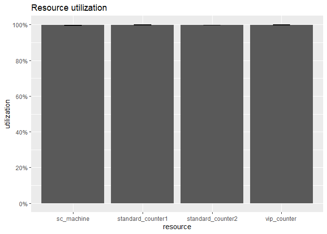<!-- -->

```r
plot(resources, metric = "usage",item = "server")
```

```
## Warning: Removed 2 row(s) containing missing values (geom_path).
```

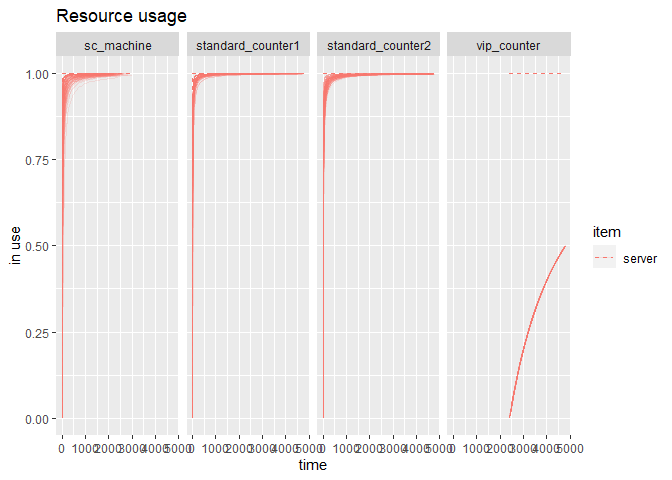<!-- -->

```r
plot(arrivals, metric="waiting_time") 
```

```
## `geom_smooth()` using method = 'gam' and formula 'y ~ s(x, bs = "cs")'
```

<!-- -->

```r
plot(resources, metric = "usage", item = "server", steps = TRUE)
```

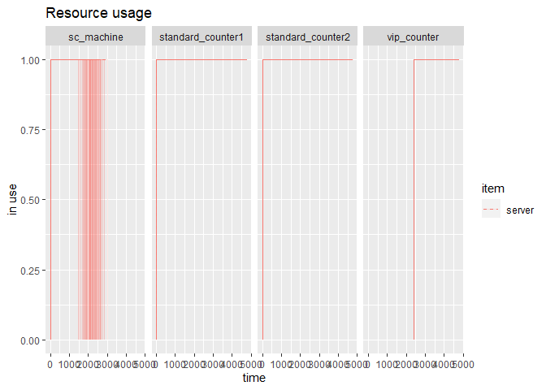<!-- -->

```r
arrivals %>%
  ggplot(aes(end_time - start_time)) +
  geom_histogram() +
  xlab("Tempo no sistema") +
  ylab("Número de passageiros")
```

```
## `stat_bin()` using `bins = 30`. Pick better value with `binwidth`.
```

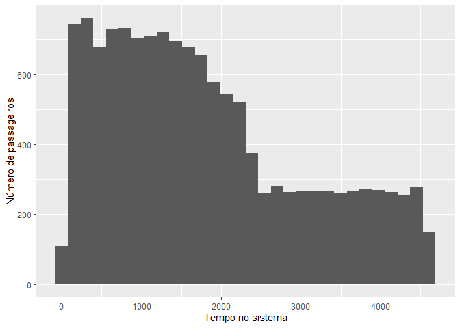<!-- -->

```r
# número de passageiros que não conseguiram terminar o check-in
(avg_left_behind_passengers <- nrow(arrivals[!arrivals$finished,])/runs)
```

```
## [1] 0
```

```r
# Cálculo do tempo de espera
arrivals <- transform(arrivals, waiting_time = end_time - start_time - activity_time)
#tempo de espera em minutos
summary(arrivals$waiting_time/60)
```

```
##    Min. 1st Qu.  Median    Mean 3rd Qu.    Max. 
##    0.00   11.72   24.28   28.29   41.22   75.37
```

```r
#tempo de espera em minutos dos VIP
summary(arrivals[grepl("VIP Passenger", arrivals$name),]$waiting_time/60)
```

```
##    Min. 1st Qu.  Median    Mean 3rd Qu.    Max. 
##   0.000   8.899  18.670  18.582  28.359  38.488
```
 
 Experimentando a fila única para os passageiros Economy:
 

```r
# Definicao da trajectoria dos passageiros Economy fila única

economy_passenger <- 
    trajectory() %>%
    #log_("Arrived at Check-In Area.") %>%
    branch(
        function() (runif(1) > 0.75) + 1, continue = c(FALSE, FALSE), # 75% tem bagagem, 25% nao tem bagagem
        trajectory() %>% # trajectoria do passageiro se tiver bagagem
            #log_("I have luggage to check.") %>%
            seize("standard_counter") %>%
            #log_("Making Check-In...") %>%
            timeout(function() rtriang(
                n = 1,
                a = triang_counter_min,
                b = triang_counter_max,
                c = triang_counter_mode) + extra_time_luggage) %>% # a=min, b=max, c=moda; tem tempo extra da bagagem
            release("standard_counter"), # %>%
            #log_("Check-in completed! Leaving Standard Counter and going to Security Checkpoint."),
        trajectory() %>% # trajectoria do passageiro sem bagagem
            #log_("I just have carry-on.") %>%
            seize("sc_machine") %>%
            #log_("Making Check-In...") %>%
            timeout(function() rtriang(
                n = 1,
                a = triang_machine_min,
                b = triang_machine_max,
                c = triang_machine_mode)) %>% # a=min, b=max, c=moda
            release("sc_machine") #%>%
            #log_("Check-in completed! Leaving Self Check-In and going to Security Checkpoint.")
    )

# horarios de funcionamento do checkin para passageiros Economy
economy_checkin_schedule <-
    schedule(
        c(begin_checkin_economy, close_checkin_all),
        c(2, 0), period = overall_checkin_time) # capacidade de atender 2 passageiros de cada vez
# horário da máquina
self_checkin_schedule <-
    schedule(
        c(begin_checkin_economy, close_checkin_all),
        c(1, 0), period = overall_checkin_time) # capacidade de atender 2 passageiros de cada vez

set.seed(42)

# Ambiente de Simulacao (100 vezes)
envs <- lapply(1:runs, function(i) {
    simmer("Check-In") %>%
    add_resource("vip_counter", capacity = vip_checkin_schedule) %>% # so 1 balcao vip, sujeito ao horario checkin vip
    add_resource("standard_counter", capacity = economy_checkin_schedule) %>% # 2 balcoes para passageiros economy
    add_resource("sc_machine", capacity = self_checkin_schedule) %>% # temos uma maquina self-checkin para passageiros sem bagagem
    add_generator("VIP Passenger", 
                 vip_passenger, 
                 from_to(start_time = begin_checkin_vip,
                         stop_time = close_checkin_all,
                         dist = function() { c(rpois(n = n_max_vip, lambda = vip_passenger_lambda), -1) },
                         arrive = F),
                 )  %>% # "gerador" de passageiros VIP chegam ao check-in com uma distribuicao Poisson (0.85)
    add_generator("Economy Passenger", 
                 economy_passenger, 
                 function() { c(rpois(n = n_max_economy, lambda = economy_passenger_lambda), -1) }
                 ) %>% # "gerador" de passageiros Economy chegam ao check-in com uma distribuicao Poisson (1.7)
    run(until = close_checkin_all) # Simulador do check-in (desenrola-se por 1h20)
})

arrivals <- get_mon_arrivals(envs)
resources <- get_mon_resources(envs)

plot(resources, metric = "utilization")
```

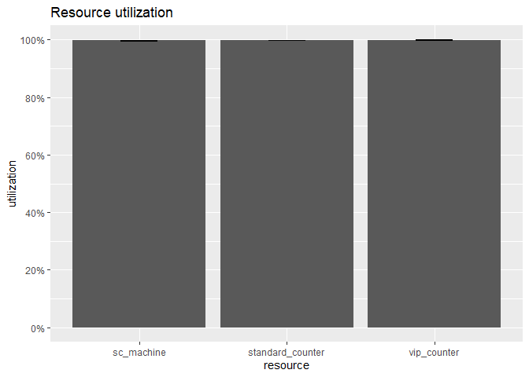<!-- -->

```r
plot(resources, metric = "usage",item = "server")
```

```
## Warning: Removed 2 row(s) containing missing values (geom_path).
```

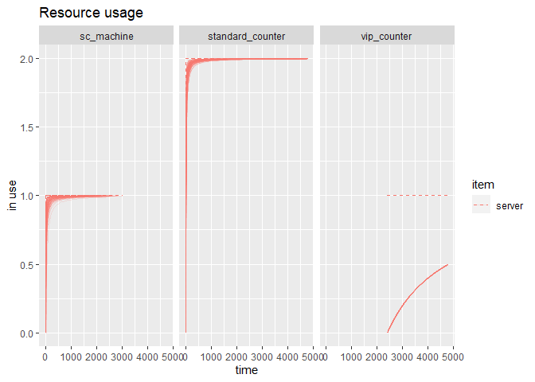<!-- -->

```r
plot(arrivals, metric="waiting_time") 
```

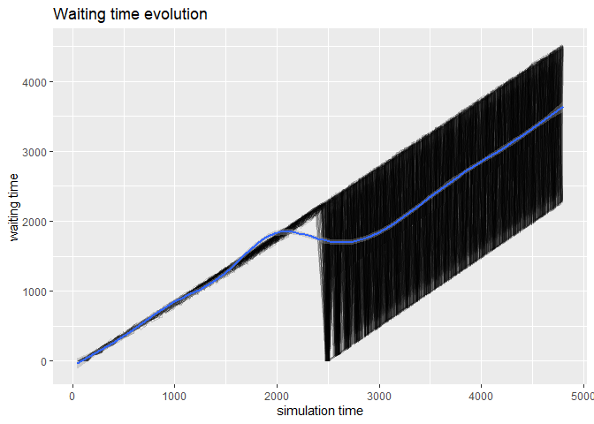<!-- -->

```r
plot(resources, metric = "usage", item = "server", steps = TRUE)
```

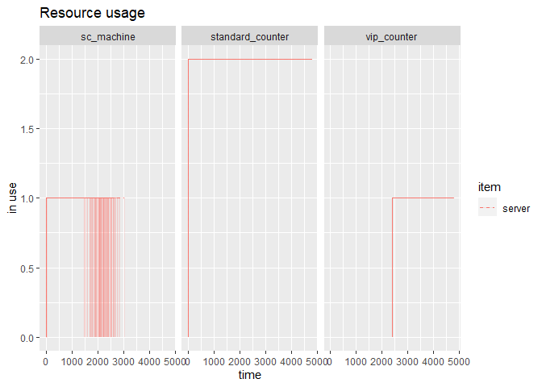<!-- -->

```r
arrivals %>%
  ggplot(aes(end_time - start_time)) +
  geom_histogram() +
  xlab("Tempo no sistema") +
  ylab("Número de passageiros")
```

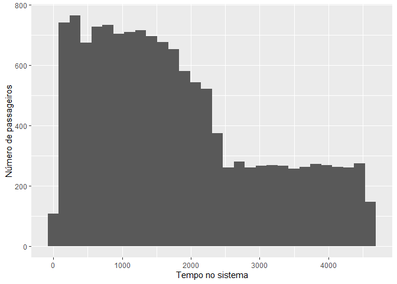<!-- -->

```r
# número de passageiros que não conseguiram terminar o check-in
(avg_left_behind_passengers <- nrow(arrivals[!arrivals$finished,])/runs)
```

```
## [1] 0
```

```r
# Cálculo do tempo de espera
arrivals <- transform(arrivals, waiting_time = end_time - start_time - activity_time)
#tempo de espera em minutos
summary(arrivals$waiting_time/60)
```

```
##    Min. 1st Qu.  Median    Mean 3rd Qu.    Max. 
##    0.00   11.72   24.29   28.29   41.20   75.34
```

```r
#tempo de espera em minutos dos VIP
summary(arrivals[grepl("VIP Passenger", arrivals$name),]$waiting_time/60)
```

```
##    Min. 1st Qu.  Median    Mean 3rd Qu.    Max. 
##   0.000   8.899  18.670  18.582  28.359  38.488
```
 
 
 ___________________________________________________________________________________

# Análise segmentação de passageiros

2) Analise o impacto da segmentação dos passageiros na distribuição do tempo total do
processo. Ou seja, analise o impacto de os passageiros Vip serem servidos por um balcão que lhes é dedicado ou não existir este balcão e estes passageiros serem servidos pelos outros dois balcões com uma prioridade maior da dos outros passageiros. 

> Assumimos que os passageiros VIP têm a mesma proporção de bagagem de porão que os outros passageiros.


```r
set.seed(42)

# Ambiente de Simulacao (100 vezes)
envs <- lapply(1:runs, function(i) {
    simmer("Check-In") %>%
    add_resource("standard_counter", capacity = economy_checkin_schedule) %>% # 2 balcoes para passageiros economy
    add_resource("sc_machine", capacity = self_checkin_schedule) %>% # temos uma maquina self-checkin para passageiros sem bagagem
    add_generator("VIP Passenger", 
                 economy_passenger, # os VIP neste caso seguem a trajetoria dos Economy, mas com maior prioridade
                 from_to(start_time = begin_checkin_vip,
                         stop_time = close_checkin_all,
                         dist = function() { c(rpois(n = n_max_vip, lambda = vip_passenger_lambda), -1) },
                         arrive = F),
                 priority = 1
                 )  %>% # "gerador" de passageiros VIP chegam ao check-in com uma distribuicao Poisson (0.85)
    add_generator("Economy Passenger", 
                 economy_passenger, 
                 function() { c(rpois(n = n_max_economy, lambda = economy_passenger_lambda), -1) }
                 ) %>% # "gerador" de passageiros Economy chegam ao check-in com uma distribuicao Poisson (1.7)
    run(until = close_checkin_all) # Simulador do check-in (desenrola-se por 1h20)
})

arrivals <- get_mon_arrivals(envs)
resources <- get_mon_resources(envs)

plot(resources, metric = "utilization")
```

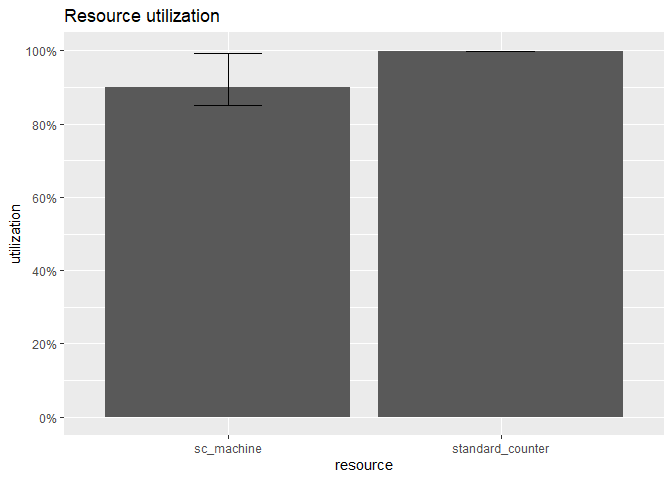<!-- -->

```r
plot(resources, metric = "usage",item = "server")
```

```
## Warning: Removed 8 row(s) containing missing values (geom_path).
```

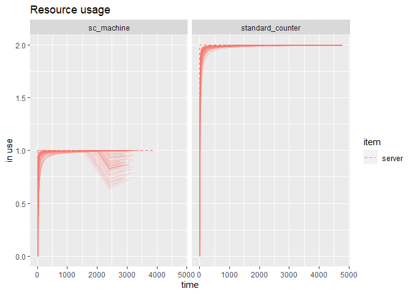<!-- -->

```r
plot(arrivals, metric="waiting_time") 
```

```
## `geom_smooth()` using method = 'gam' and formula 'y ~ s(x, bs = "cs")'
```

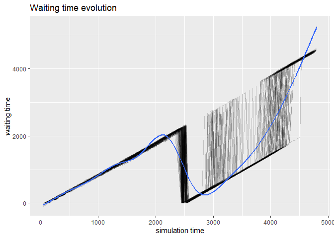<!-- -->

```r
plot(resources, metric = "usage", item = "server", steps = TRUE)
```

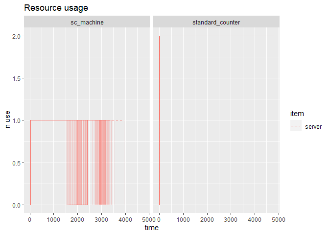<!-- -->

```r
arrivals %>%
  ggplot(aes(end_time - start_time)) +
  geom_histogram() +
  xlab("Tempo no sistema") +
  ylab("Número de passageiros")
```

```
## `stat_bin()` using `bins = 30`. Pick better value with `binwidth`.
```

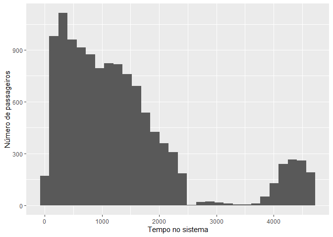<!-- -->

```r
# número de passageiros que não conseguiram terminar o check-in
(avg_left_behind_passengers <- nrow(arrivals[!arrivals$finished,])/runs)
```

```
## [1] 0
```

```r
# Cálculo do tempo de espera
arrivals <- transform(arrivals, waiting_time = end_time - start_time - activity_time)
#tempo de espera em minutos
summary(arrivals$waiting_time/60)
```

```
##    Min. 1st Qu.  Median    Mean 3rd Qu.    Max. 
##   0.000   7.015  16.153  20.652  26.588  76.699
```

```r
#tempo de espera em minutos dos VIP
summary(arrivals[grepl("VIP Passenger", arrivals$name),]$waiting_time/60)
```

```
##    Min. 1st Qu.  Median    Mean 3rd Qu.    Max. 
##   0.000   4.158   9.130  10.730  16.944  32.681
```


